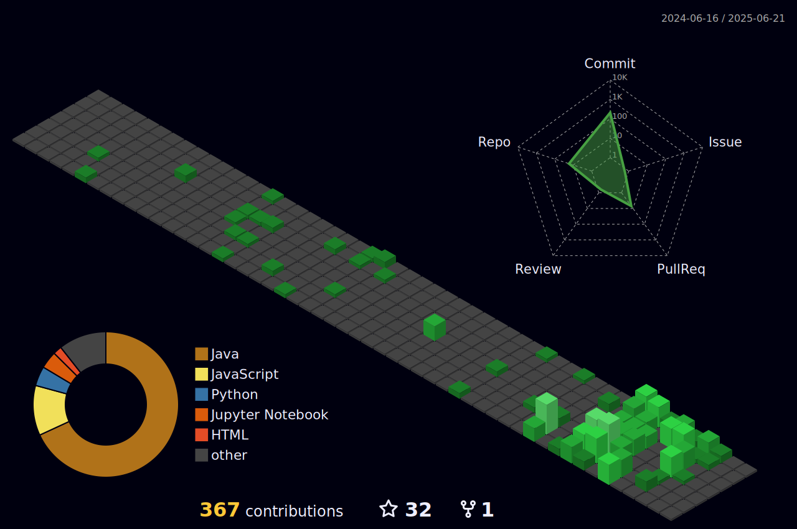

<h1 align="center">👋 Hey, I'm Varad Kulkarni!</h1>

  

## 🏆 GitHub Trophies

# 💫 About Me:
🌱 I’m currently learning : **GenAI, CyberSecurity and Computer Networks**  🌐 Visit my website here for more information: https://varad-kulkarni-portfolio.vercel.app/   📝 I will express my thoughts on [@LowLatencyLad](https://x.com/LowLatencyLad)   
📫 You can contact me through **varadkulkarni172@gmail.com**  ⚡ Fun fact: **`git blame` shows me the author for every error :)**

## 🌐 Other Socials / Code Crunching:
  

# 💻 Tech Stack:
                     

# 📊 GitHub Stats:

 

## ✍️ My BLogs

<a href="https://varadkulkarni.hashnode.dev/mastering-sql-from-basics-to-advanced-techniques-and-real-world-applications" target="_blank" style="text-decoration: none; color: inherit;">
  

    
    

      <h3 style="margin-top: 0; margin-bottom: 8px;">Mastering SQL: From Basics to Advanced Techniques and Real-World Applications</h3>
      
Unlocking the Power of Data Management through SQL. Published on Hashnode (Jul 2024).

    

  

</a>

<a href="https://varadkulkarni.hashnode.dev/memory-management-in-mobile-os" target="_blank" style="text-decoration: none; color: inherit;">
  

    
    

      <h3 style="margin-top: 0; margin-bottom: 8px;">Memory Management in Mobile OS</h3>
      
An overview of how the memory management is handled in mobile Operating Systems. Published on Hashnode (Apr 2024).

    

  

</a>

---
