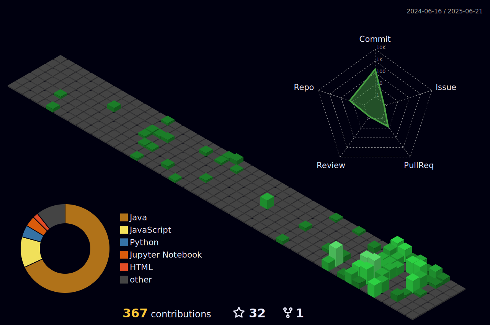

<h1 align="center">Hey, I'm Varad Kulkarni 👋</h1>

  

---

## 🧠 About Me

- Building systems at the intersection of **GenAI + Distributed Systems**
- Strong focus on **performance, scalability, and real-world engineering**
- Currently exploring:
  - LLM pipelines
  - Computer Networks
  - Cybersecurity

📌 Portfolio: https://varad-kulkarni-portfolio.vercel.app/  
📬 Email: varadkulkarni172@gmail.com  
🧵 X: https://x.com/varadnk  

---

## 📊 3D Contribution Graph

---

## 🏆 GitHub Trophies

  

---

## ⚙️ Tech Stack

### Backend
- FastAPI
- Node.js / Express
- MongoDB
- Redis
- Docker
- **Kubernetes**

### Frontend
- React.js
- Tailwind CSS

### AI / ML
- PyTorch
- HuggingFace Transformers
- LangChain
- Sentence Transformers

---

## 📈 GitHub Stats

  

---

## ✍️ Writing

- SQL Deep Dive → https://varadkulkarni.hashnode.dev/mastering-sql-from-basics-to-advanced-techniques-and-real-world-applications  
- Memory Management → https://varadkulkarni.hashnode.dev/memory-management-in-mobile-os  

---

## 🧩 Current Focus

- Building **Vakya.ai**
- Exploring **AI-native developer tooling**
- Deep diving into **distributed infra + networking**

---

## ⚡ Fun

> git blame shows me the author for every bug

---
